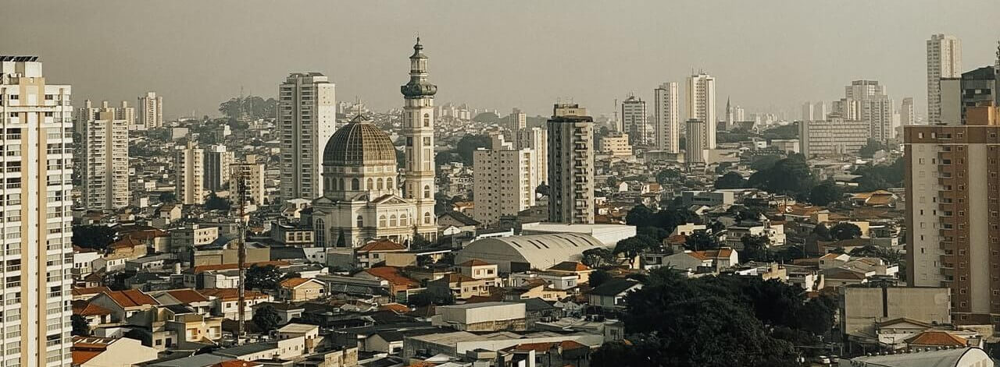
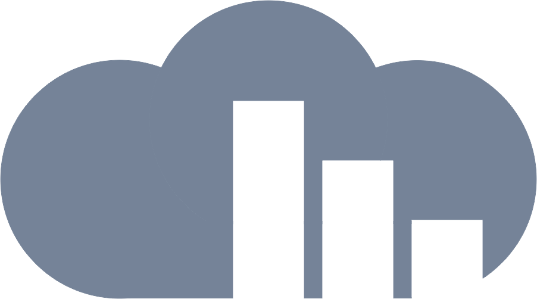

<p align="center">
  
</p>

<h1 align="center">
  4º Imersão de Dados Alura<br/><br/>
</h1>

Português | [Inglês](readme-en_us.) |

<br/>

## Sumário

- [Sobre o projeto](#sobre-o-projeto)
- [Objetivos](#objetivos)
- [Aulas](#aulas)
  - [Aula 01](#aula-01)
  - [Aula 02](#aula-02)
  - [Aula 03](#aula-03)
  - [Aula 04](#aula-04)
  - [Aula 05](#aula-05)
- [Conclusão](#set-up-a-production-environment)
- [Softwares](#softwares)
- [Outro projetos](#conheça-meus-outros-projetos)

## Sobre o projeto

**[Terra](https://terra.money)** is a public, open-source, proof-of-stake blockchain. **The Terra Core** is the reference implementation of the Terra protocol written in Golang. The Terra Core is powered by the [Cosmos SDK](https://github.com/cosmos/cosmos-sdk) and [Tendermint](https://github.com/tendermint/tendermint) BFT consensus.

   For Windows:

   ```sh
   wget <https://golang.org/dl/go1.18.2.linux-amd64.tar.gz>
   sudo tar -C /usr/local -xzf go1.18.2.linux-amd64.tar.gz
   export PATH=$PATH:/usr/local/go/bin
   export PATH=$PATH:$(go env GOPATH)/bin
   ```


## `terrad`

`terrad` is the all-in-one CLI and node daemon for interacting with the Terra blockchain.

## Objetivos

**[Terra](https://terra.money)** is a public, open-source, proof-of-stake blockchain. **The Terra Core** is the reference implementation of the Terra protocol written in Golang. The Terra Core is powered by the [Cosmos SDK](https://github.com/cosmos/cosmos-sdk) and [Tendermint](https://github.com/tendermint/tendermint) BFT consensus.

## Aulas

As aulas e os desafios de cada módulo foram divididas de forma a haver uma progressão natural do aluno, trazendo conteúdo do mais básico ao avançado confirme as aulas forem saindo.

Se você gostou do projeto ou tem alguma sugestão acesse o [site](https://dastratus.com.br) mande um e-mail para bruno@dastratus.com.br.

## Softwares e Bibliotecas

Jupyter Notebook
Pandas
Google Colab
Matplotlib
Seaborn

## Conheça meus outros projetos

Visite o meu [site](https://dastratus.com.br/) para saber mais sobre mim ou sobre outros projetos.

© 2022 Bruno Maeda,

<p align="center">
    <a href="https://dastratus.com.br/"></a>
</p>
<div align="center">
</div>
